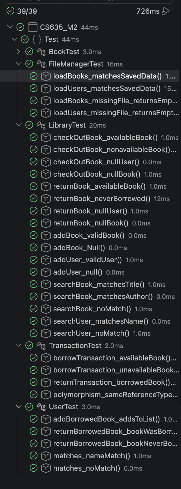
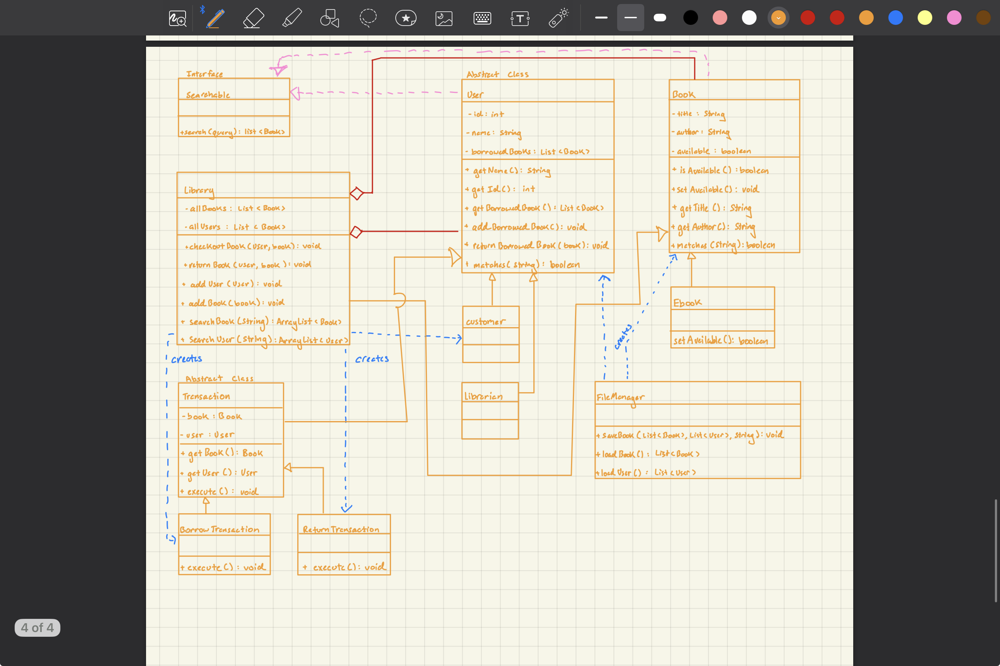

## CS635: M2 Library Mangement System
This library management system tracks Which books are currently available inside a library. User's can borrow books from the library and also return them. 

### Class Hierachy
Inside this project there are multple instances of inherietence: customer and librarian extending User, Ebook exteneded Book, and BorrowTransaction and ReturnTransaction extending. Both customer and librarian all share the same basic needs such as having a name and id at the library and the ability to borrow and return books to the library. Ebook needs to be a subclass since it overides isAvailable() of Books. The last example which also requeires inheritence to allow for polymorphism. Without them inheriting from the same class, the caller would also need to know the exact type every single call. 

### Encapsulation
Encapsulation is used inside mostly all base class to protect the data inside them. Only alowing getters for read only acess to data. The privated information protect cruial data like user name and id. Setter and other fuction calls remain public to allow outside classes to call them, such as Book.setAbailable() being called in BorrowTransaction.

### Polymorphism
Polymorphism can be seen in the Transaction abstract class and its subclass of BorrowTransaction and ReturnTransaction. Both subclass contain only 1 execute function which run the code for returning or borrowing. Both subclass have the same reference class but just different behavior when calling execute. This makes the transaction process easier to use without needing to know the parameters for the methods.

### Interfaces and Abstract Classes
Searchable was implemnted as an interface since all users and books need to be able to do matches() function, but dont share comman parent class or fields. Books need to be able to compare titles and author and users need to be able to compare names. Users was implemented as an abstract class since its subclass share common fields in ID and Names.

### Persistence 
The persistence inside this project lies in the FileManager class. This class allows for the person running the code to either save all the data into a txt file: first line being the arraylist of all books, and the second line being an arraylist of all users. Data can also be loaded a file but the loading of books and users are done in different functions calls. When using any methods inside the FileManager, you need to provide the filepath to the file being written or read from. I used a txt file since I've already had experiences in the past using in the past. 

### Testing
All core functionallity of the Library Management system are tested by the unit test and split into 4 different files. Each testing their sepecific class name. UserTest, BookTest, and TransactionTest test wheter the function calls work given different parameters, such as nulls and some edge cases. The majority of the test are in the LibraryTest.java which covers checking out / returning, adding users/books, and searching through all books and users for specific query mathces. 

Image of all the test passing. 

